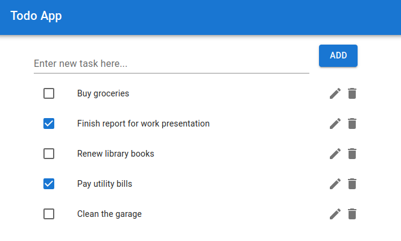

# Introduction

This project contains Frontend UI code for [gcp-gke-hexagonal-todo-service](https://github.com/dominikcebula/gcp-gke-hexagonal-todo-service).

# Tools used

- React
- MUI
- NPM
- notistack
- axios
- Jest
- React Testing Library
- Mock Service Worker

# Code structure

Currently project uses a simple code structure because complexity of the current code version is low.

In case of complexity outgrowing chosen code structure, code structure would be evolved to more advanced code structures, please see more on this topic under [React Code Structure](https://blog.webdevsimplified.com/2022-07/react-folder-structure/)

# Features

- List Todo Items
- Create a new Todo Item
- Update existing Todo Item
- Mark Todo Item as Completed
- Unmark Todo Item as Completed
- Delete Todo Item

# Author

Dominik Cebula

- https://dominikcebula.com/
- https://blog.dominikcebula.com/
- https://www.udemy.com/user/dominik-cebula/
